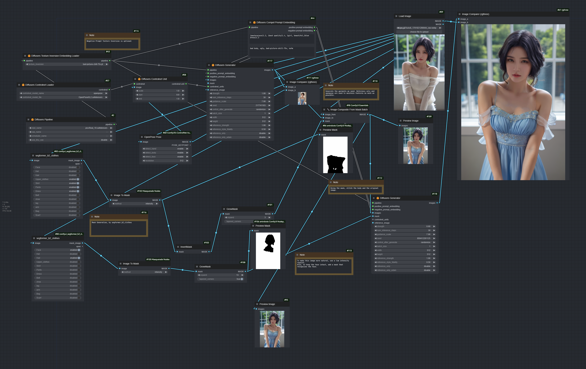

# ComfyUI-J

Jannchie's ComfyUI custom nodes.

This is a completely different set of nodes than Comfy's own KSampler series.
This set of nodes is based on Diffusers, which makes it easier to import models, apply prompts with weights, inpaint, reference only, controlnet, etc.

## Installation

In the `custom_nodes` directory, run

```bash
git clone github.com/Jannchie/ComfyUI-J
cd ComfyUI-J
pip install -r requirements.txt
```

## Examples

### Base Usage of Jannchie's Diffusers Pipeline


### Reference Only with Jannchie's Diffusers Pipeline


### ControlNet with Jannchie's Diffusers Pipeline


## Inpainting with Jannchie's Diffusers Pipeline


## Remove something with Jannchie's Diffusers Pipeline


## Change Clothes with Jannchie's Diffusers Pipeline

This is a composite application of diffusers pipeline custom node. Includes:

- Reference only
- ControlNet
- Inpainting
- Texture Inversion

This is a demonstration of a simple workflow for properly dressing a character.

A checkpoint for stablediffusion 1.5 is all your need. But for full automation, I use the Comfyui_segformer_b2_clothes custom node for generating masks. you can draw your own masks without it.



## TODO

- [ ] Add LoRA support
