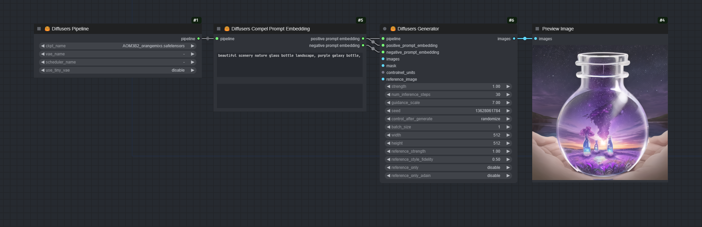
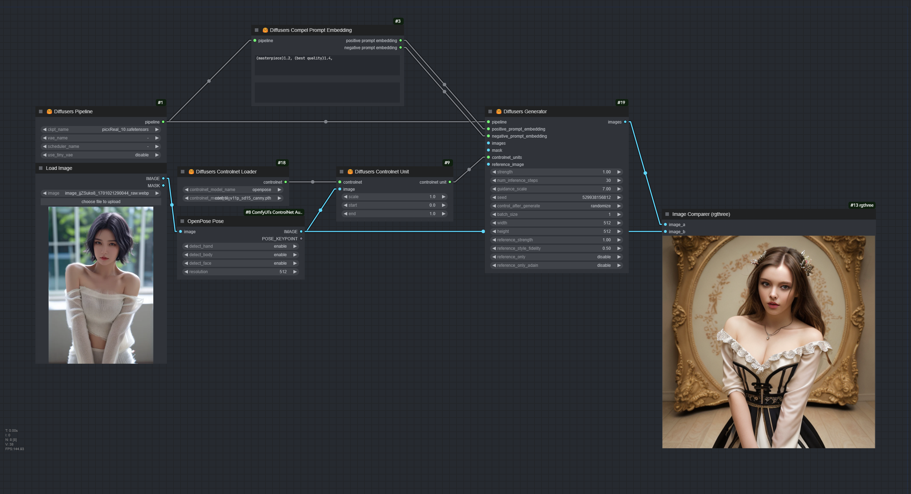

# ComfyUI-J

## Introduction

Jannchie's ComfyUI custom nodes.

This is a completely different set of nodes than Comfy's own KSampler series.
This set of nodes is based on Diffusers, which makes it easier to import models, apply prompts with weights, inpaint, reference only, controlnet, etc.

## Installation

In the `custom_nodes` directory, run

```bash
git clone https://github.com/Jannchie/ComfyUI-J
cd ComfyUI-J
pip install -r requirements.txt
```

## Examples

### Base Usage of Jannchie's Diffusers Pipeline

You only have to deal with 4 nodes. The default comfy workflow uses 7 nodes to achieve the same result.



### Reference Only with Jannchie's Diffusers Pipeline

ref_only supports two modes: attn and attn + adain, and can adjust the style fidelity parameter to control the style.


### ControlNet with Jannchie's Diffusers Pipeline



## Inpainting with Jannchie's Diffusers Pipeline


## Remove something with Jannchie's Diffusers Pipeline


## Change Clothes with Jannchie's Diffusers Pipeline

This is a composite application of diffusers pipeline custom node. Includes:

- Reference only
- ControlNet
- Inpainting
- Textual Inversion

This is a demonstration of a simple workflow for properly dressing a character.

A checkpoint for stablediffusion 1.5 is all your need. But for full automation, I use the `Comfyui_segformer_b2_clothes` custom node for generating masks. you can draw your own masks without it.


## FAQ

### Why Diffusers?

Unlike Web UI and Comfy, Diffusers is an image generation tool for researchers. It has a large ecosystem, a clearer code structure and a simpler interface.

ComfyUI's KSampler is nice, but some of the features are incomplete or hard to be access, it's 2042 and I still haven't found a good Reference Only implementation; Inpaint also works differently than I thought it would; I don't understand at all why ControlNet's nodes need to pass in a CLIP; and I don't want to deal with what's going on with Latent, please just return an Image instead of making me decode it with a vae. Diffusers provides a pipeline wrapper that makes generation a lot easier.

### Why ComfyUI?

But combining research results is not an easy task, Comfy is good at combining and sharing combinations with others. While debugging custom nodes as a developer can be a pain, using Comfy makes it faster to verify and share.

## TODO

- [ ] Add LoRA support
- [ ] Stable Diffusion XL support
